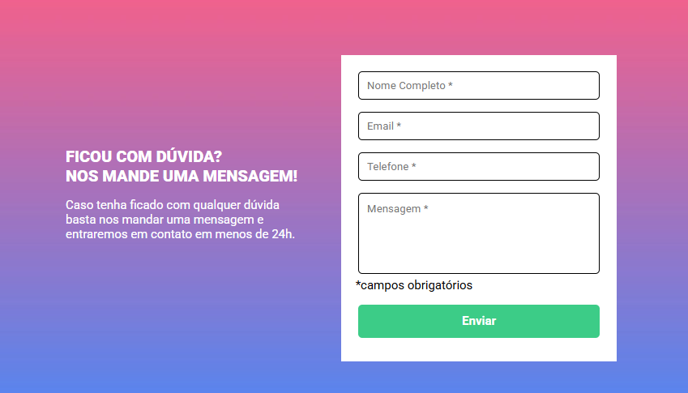
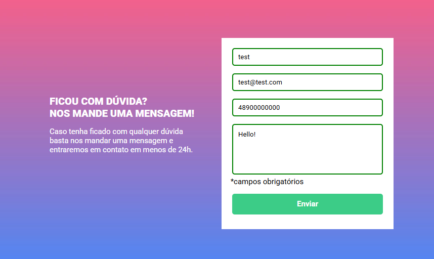
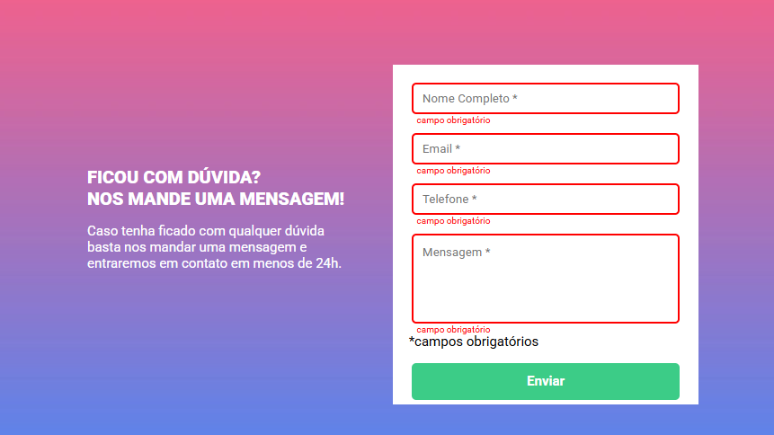

## Projeto JS Intermediario, utilizando HTML e CSS do curso Dev Quest. 

Landing page foi criada utilizando conhecimentos de JS intermediário, HTML avançado e CSS avançado. Com design base web fornecida no Figma.

## Tecnologias Utilizadas

- HTML
- CSS
- JS 