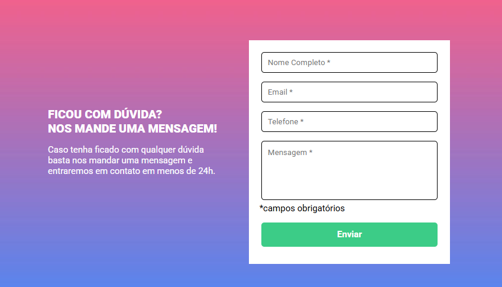
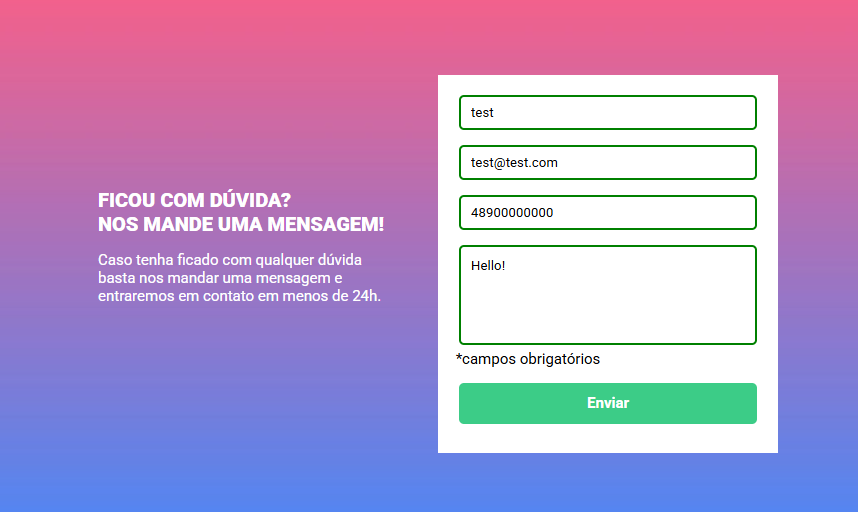
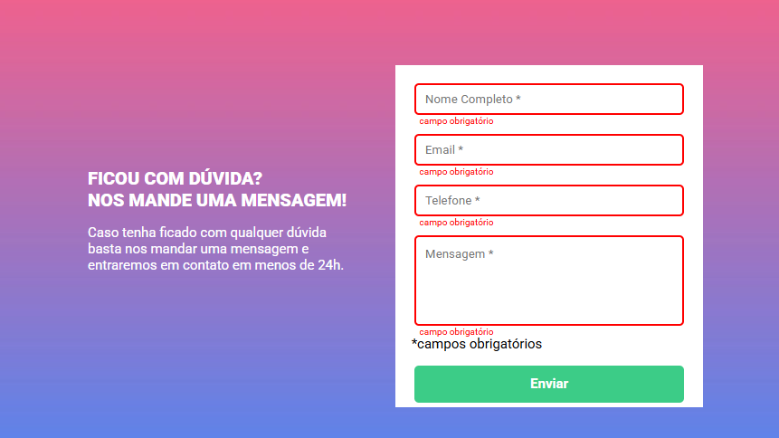

## Formulário com Validação - Custo DevQuest. 

Landing page foi criada utilizando conhecimentos de JS intermediário, HTML e CSS avançados. Com design base fornecida no Figma.
A proposta é realizar a validação de informações de um formulário utilizando conhecimento em JavaScript. 

• Na primeira imagem é o layout proposto, sem as validações feitas por JS. 
• Na segunda imagem foi feita a validação dos campos, adicionando uma borda verde em volta dos elementos para avisar visualmente que o campo estava ok. 
• Na ultima imagem mostra os campos sem as informações obrigatórias estarem preenchidas, adicionando assim, uma borda vermelha e adicionando a mensagem de "campo obrigatório". 

## Tecnologias Utilizadas

- HTML
- CSS
- JS 
